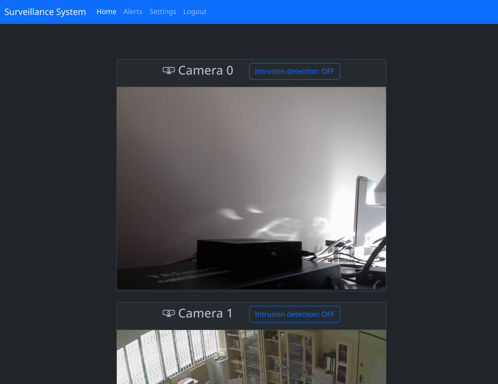
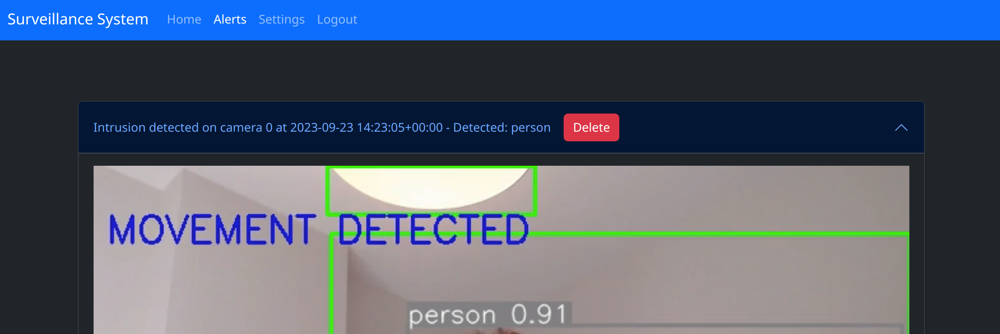
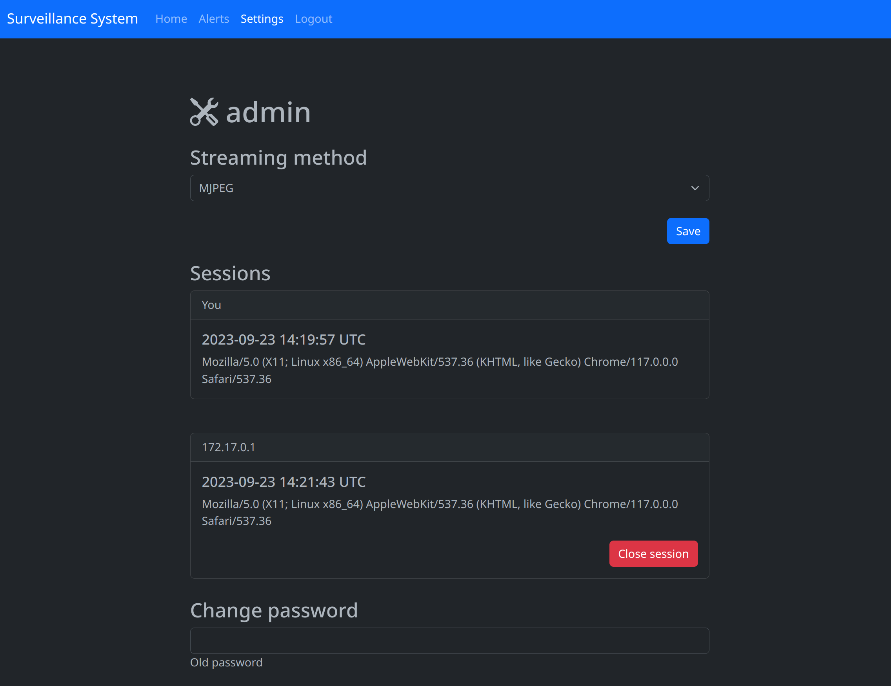

# Setup and dependencies

Install docker.

## Code folder

`./code/`

## Optional
 
`ffmpeg` and `v4l2loopback` if you want to forward streams different than the webcams (mjpeg/videos).

## Notifications

Set PUSHOVER_APP_TOKEN and PUSHOVER_USER_KEY env variables if you want phone notifications.

# Run

`cd code && ./run.sh`

# Open

`http://127.0.0.1:8001`

Default credentials: `admin:password`

# Sceenshots

